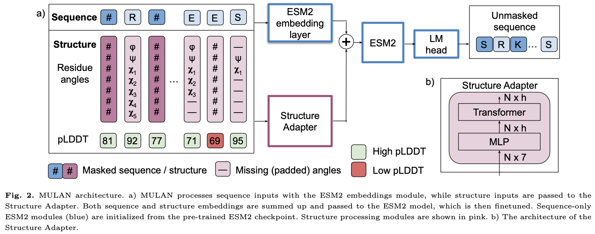
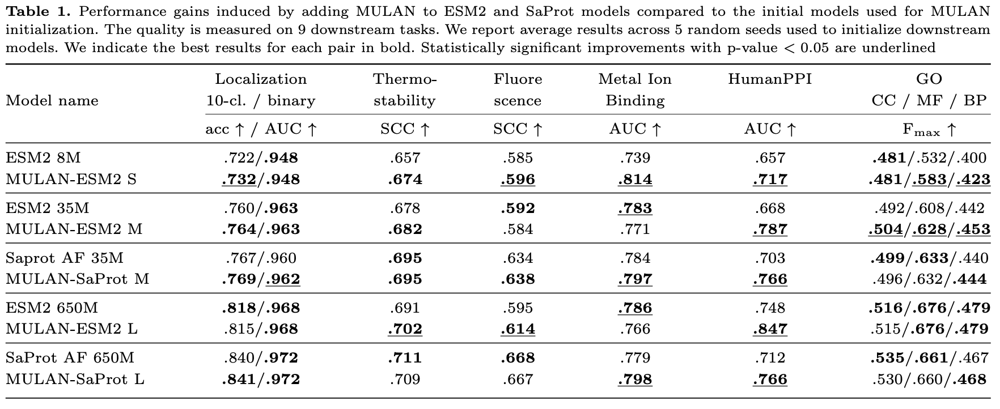
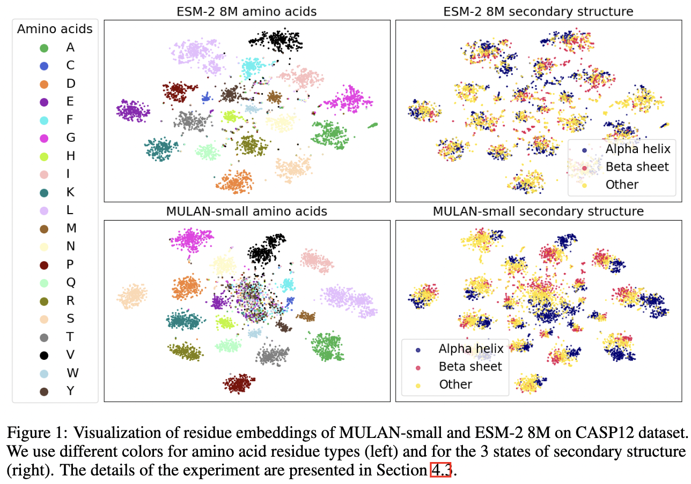

# MULAN: Multimodal Protein Language Model for Sequence and Structure Encoding

This is an official implementation of the paper [MULAN: Multimodal Protein Language Model for Sequence and Structure Encoding](https://www.biorxiv.org/content/10.1101/2024.05.30.596565v1).

## News
\textbf{31/03/2025} Added MULAN-ESM2 checkpoints for medium and large models, updated MULAN-small. Code update: MULAN now uses rotary positional embeddings and has improved quality. 

## Overview
MULAN is a MULtimodal encoder PLM for both sequence and ANgle-based structure processing. 
MULAN uses the pre-trained base PLM and has the Structure Adapter – a module we introduce to incorporate the knowledge about the 3D protein structure. 
Our model uses ESM-2 architecture, initializing the base PLM from ESM-2 or SaProt models. 
However, MULAN can be based on other PLMs.



MULAN offers a cheap increase of the quality of the protein representations compared to the protein language models used to initialize it, which is illustrated on various downstream tasks.


Also, MULAN demonstrates the structural awareness of the obtained embeddings.



## Installation
To install repo run the command inside the folder MULAN:
```bash
git clone https://github.com/DFrolova/MULAN.git
cd MULAN
pip install -e .
```

Also, you should download and put the foldseek binary file into the `mulan/bin` folder following the instructions provided in the [SaProt repo](https://github.com/westlake-repl/SaProt?tab=readme-ov-file#convert-protein-structure-into-structure-aware-sequence). 
Currently, they provide it [here](https://drive.google.com/file/d/1B_9t3n_nlj8Y3Kpc_mMjtMdY0OPYa7Re/view).
Do not forget to add the rights for execution for foldseek (`chmod +x bin/foldseek`).
If you do not need foldseek sequences (you use only MULAN based on ESM-2), you can pass `extract_foldseek_in_tokenizer=False` when initializing the `ProteinDataset`.
Thus, you do not need to download and use the foldseek binary file.

## Quick start
The code for the MULAN inference and embedding extraction is presented in `example.ipynb`.
Also, we detail the required steps in a step-by-step fashion below. 

1) **Collect protein structures.**
Put the protein structures (either `.pdb` or `.cif` files) you need to encode into the folder. 
The whole path to this folder is `protein_data_path`.
If you need to extract certain chains from the structure (for experimental structures), you need to specify the chain name in the name of the file in the format: `{protein_id}_{chain}.pdb`.
Othervise, the first chain would be extracted.

In case of experimental structures, you firstly need to preprocess them with `pdbfixer` to restore missing atoms, remove water from the PDB file, etc.
Firstly, you need to install `pdbfixer`. It should be installed in a separate environment for structure processing:
```bash
conda create -n pdb_processing python=3.7
conda activate pdb_processing
conda install pdbfixer=1.8.1 -c conda-forge
conda install biopython=1.78
```
Then, you run the script, providing correct paths for `initial_structure_path` and `preprocessed_structure_path`.
```bash
python scripts/preprocess_experimental_structures.py -i <initial_structure_path> -o <preprocessed_structure_path>
```


2) **Load the dataset and preprocess the data.**
Also, prepare the dataloader. By default, the dataset would not aggeragate proteins into batches (1 portein = 1 batch). 
However, you can pass `use_sorted_batching=True` to the dataset (and still pass `batch_size=1` to the dataloader!) to aggregate proteins with similar lengths into the batch (maximim `batch_limit` tokens per batch) for a faster inference. 
Further steps of code suppose that each batch contains one protein.
```python
import numpy as np
import torch
from torch.utils.data import DataLoader
from mulan.dataset import ProteinDataset, data_collate_fn_dynamic

protein_data_path = <> # specify the path to the folder with pdb files you need to pass to the model
saved_dataset_path = <> # specify the path where to save the preprocessed dataset
use_foldseek_sequences = False # True if use SaProt initialization for MULAN. Else False
is_experimental_structure = False # flag for either AlphaFold structures or experimental ones

dataset = ProteinDataset(
    protein_data_path=protein_data_path, 
    saved_dataset_path=saved_dataset_path,
    use_foldseek_sequences=use_foldseek_sequences,
    # batch_limit=5000, # default number of tokens per batch (you can increase it for a faster inference with `use_sorted_batching=True`)
    # use_sorted_batching=True,
    # extract_foldseek_in_tokenizer=False,
    is_experimental_structure=is_experimental_structure,
)
```

Note that initializing dataset requires firstly to preprocess and tokenize all provided protein structures.
The results will be stored in the `saved_dataset_path` folder.
Further, if you reuse this dataset, the preprocessing step is not required if you store the data inside the `saved_dataset_path`.

During preprocessing, foldseek sequences are also extracted. 
This is done because SaProt-initialized MULAN uses Foldseek.
If you use only ESM-2, you can pass argument `extract_foldseek_in_tokenizer=False` into the `ProteinDataset` class.

3) **Load the model.** Load the pre-trained model from Huggingface. Available models:
   - [MULAN-small 9M](https://huggingface.co/DFrolova/MULAN-small)
   - [MULAN-ESM2 M](https://huggingface.co/DFrolova/MULAN-ESM2-35M)
   - [MULAN-ESM2 L](https://huggingface.co/DFrolova/MULAN-ESM2-650M)
   
```python
from mulan.model import StructEsmForMaskedLM

model = StructEsmForMaskedLM.from_pretrained(
    'DFrolova/MULAN-small',
    device_map="auto",
)
device = 'cuda:0' if torch.cuda.is_available() else 'cpu'
model.to(device)
```

4) **Prepare the dataloader**
```python
from mulan.model_utils import auto_detect_base_tokenizer

esm_tokenizer = auto_detect_base_tokenizer(model.config, use_foldseek_sequences)

# Initialize dataloader
def data_collator(x): 
    if use_foldseek_sequences:
        one_letter_aas = esm_tokenizer.all_tokens[5:]
    else: 
        one_letter_aas = dataset.tokenizer.one_letter_aas

    return data_collate_fn_dynamic(x, 
        esm_tokenizer=esm_tokenizer,
        nan_value=np.deg2rad(dataset.tokenizer.nan_fill_value),
        mask_inputs=False,
        all_amino_acids=one_letter_aas,
        use_foldseek_sequences=use_foldseek_sequences)

dataloader = DataLoader(dataset, batch_size=1, shuffle=False, collate_fn=data_collator)
```

5) **Run inference** to extract residue-level embeddings from the last layer of MULAN. 
Each batch contains one protein sequence.
```python
with torch.no_grad():
    for i, (batch, batch_names) in enumerate(zip(dataloader, dataset.protein_names)):
        struct_inputs = [struct_input.to(device) for struct_input in batch['struct_inputs']]
        # extract embeddings for each batch (1 sequence per batch)
        embeddings = model(
            input_ids=batch['input_ids'].to(device),
            attention_mask=batch['attention_mask'].to(device),
            struct_inputs=struct_inputs,
            output_hidden_states=True
        )['hidden_states'][-1]
        embeddings = embeddings[0][1:-1] # residue-level embeddings for the case of 1 protein per batch
        
        # If you want to get protein-level embeddings, you shoud perform average pooling:
        protein_embedding = embeddings.mean(dim=0)
        print(batch_names, embeddings.shape, protein_embedding.shape)
```

If you want to get protein-level embeddings, you shoud perform average pooling:
```python
embeddings = embeddings.mean(dim=0)
```

## Pre-trained models
The pre-trained model weights for MULAN-small are released in [DFrolova/MULAN-small](https://huggingface.co/DFrolova/MULAN-small).
Medium-sized MULAN models will be added within several months.


## Training dataset and downstream datasets
### Training dataset
The raw training data (AF-17M) can be downloaded from the [ProstT5 repository](https://github.com/mheinzinger/ProstT5?tab=readme-ov-file#-training-data).
The angle information should be extracted from these structures using the script detailed below. 
Also, all angles should be preprocessed using the `Tokenizer` class for the faster use during training.

The small dataset (AF-0.5M) that was used for MULAN-small training is released in [DFrolova/MULAN_datasets](https://huggingface.co/datasets/DFrolova/MULAN_datasets).
You should manually download AF05_pretraining.zip.


### Downstream datasets
All downstream datasets that are used in our paper are publicly available. 
The raw downstream dataset structures can be downloaded from the AlphaFold database by their corresponding UniProt IDs.

The preprocessed downstream datasets are available for download at [DFrolova/MULAN_datasets](https://huggingface.co/datasets/DFrolova/MULAN_datasets).
You should manually download each downstream task archive.
Each dataset folder contains `id2label.json` file with targets for each dataset split and a folder `dataset` with the preprocessed dataset ready to pass into the `ProteinDataset` class.


## Inference
To run inference on all downstream datasets, run
```bash
CUDA_VISIBLE_DEVICES=0 python mulan/eval_adapter.py -c configs/eval/eval_mulan_small.yaml
```
This script would save protein-level embeddings for all downstream tasks into the folder you would specify in the config file.
The same procedure should be done for other models (MULAN-ESM2 or MULAN-SaProt). 
You need to select the correct config for both training and inference.
Also, you need to set correct model name for the `trained_adapter_name` argument in the config file: it should be the same as the trained model path that contains model checkpoint.


## Downstream task evaluation
Finally, to run predictions for all types of downstream tasks, you need to run the script 
```bash
python scripts/downstream.py -c configs/downstream.yaml
```
This script requires the pre-computed and saved protein embeddings for all downstream tasks.
You need to specify the correct path to the folder with downstream datasets as well as the desired downstream tasks you want to evaluate.
Also, you should specify the model names that were used to produce embeddings (names of folders with embeddings for downstream tasks).


## Training
The configs below require the correct data paths provided inside the config file. 

To run training for MULAN-small, run
```bash
CUDA_VISIBLE_DEVICES=0 python mulan/train_adapter.py -n mulan_small -c configs/mulan_small.yaml
```
The same should be done for other models using the corresponding config files.
The name that you pass during training is used to create the output folder with training checkpoints. 


### Citation
If you use MULAN in your work, please cite our paper:

```
@article{frolova2024mulan,
  title={MULAN: Multimodal Protein Language Model for Sequence and Structure Encoding},
  author={Frolova, Daria and Pak, Marina and Litvin, Anna and Sharov, Ilya and Ivankov, Dmitry and Oseledets, Ivan},
  journal={bioRxiv},
  pages={2024--05},
  year={2024},
  publisher={Cold Spring Harbor Laboratory}
}
```
